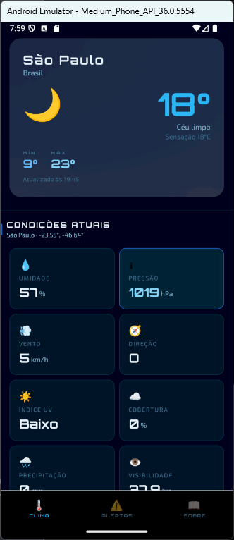
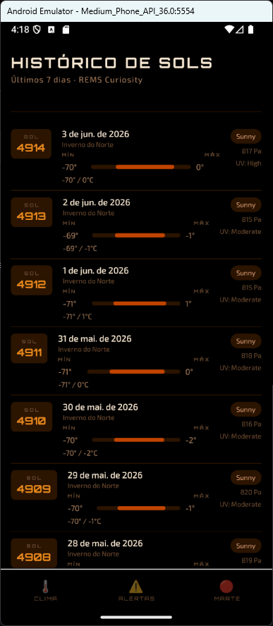
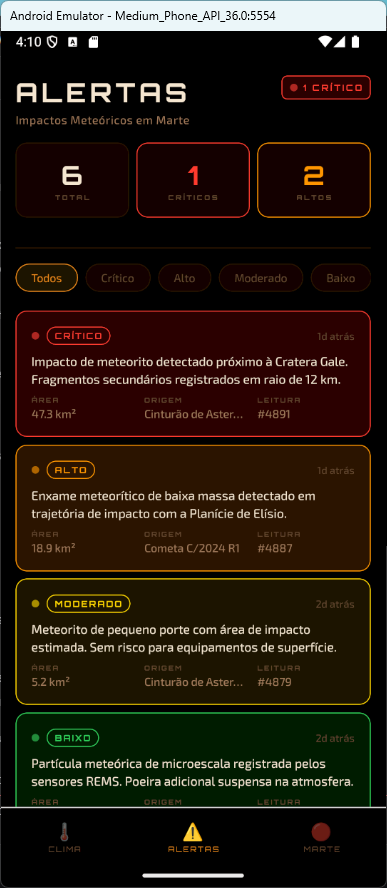
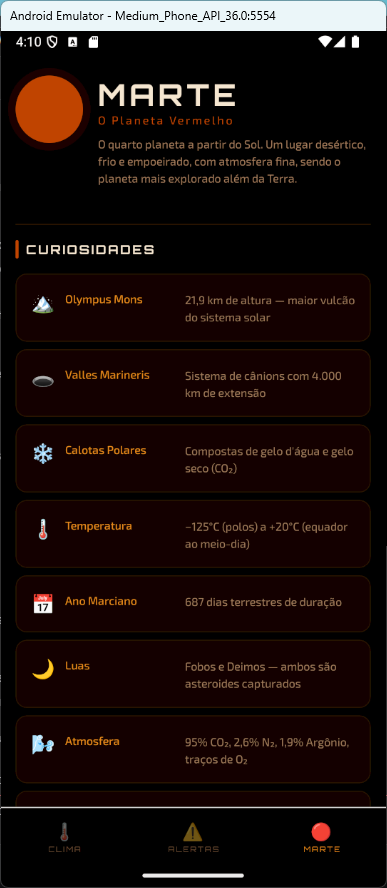

# Clima

App React Native de previsão do tempo com alertas de meteoros.


## Funcionalidades

| Tela | Conteúdo |
|------|----------|
| **Clima** | Busca por cidade, temperatura, condições atuais, previsão de 7 dias |
| **Alertas** | Alertas simulados de impactos meteóricos por nível de criticidade |
| **Sobre** | Glossário com 11 termos meteorológicos explicados |

### Telas

<details>
<summary>🌡️ Clima</summary>



</details>

<details>
<summary>📊 Histórico de Sóis</summary>



</details>

<details>
<summary>⚠️ Alertas</summary>



</details>

<details>
<summary>🔴 Marte</summary>



</details>

</details>

## Fonte dos Dados

- **Clima:** [Open-Meteo](https://open-meteo.com) — gratuita, sem chave de API
- **Geocoding:** Open-Meteo Geocoding API — converte nome de cidade em coordenadas
- **Alertas:** Dados simulados (mockados)

## Como Rodar

### Pré-requisitos

- Node.js 18+
- App **Expo Go** instalado no celular ([iOS](https://apps.apple.com/app/expo-go/id982107779) / [Android](https://play.google.com/store/apps/details?id=host.exp.exponent))

### Instalação

```bash
npm install
npx expo start
```

Escaneie o QR code com o Expo Go para abrir no celular.


## Estrutura do Projeto

```
```
├── app/
│   ├── _layout.tsx          # Layout raiz e barra de abas
│   ├── index.tsx            # Tela: Clima
│   ├── alerts.tsx           # Tela: Alertas
│   ├── about.tsx            # Tela: Sobre / Glossário
│   └── history.tsx          # Oculta (não usada)
├── components/
│   └── UI.tsx               # Componentes reutilizáveis
├── styles/
│   ├── clima.styles.ts
│   ├── alertas.styles.ts
│   ├── sobre.styles.ts
│   ├── historico.styles.ts
│   └── ui.styles.ts
├── services/
│   └── openmeteo.ts         # Cliente Open-Meteo + geocoding
├── constants/
│   └── theme.ts             # Cores, tipografia, espaçamentos
```

## Tecnologias

- [Expo](https://expo.dev) (managed workflow)
- [Expo Router](https://expo.github.io/router) — navegação baseada em arquivos
- [TypeScript](https://www.typescriptlang.org)
- Fontes: [Orbitron](https://fonts.google.com/specimen/Orbitron) + [Exo 2](https://fonts.google.com/specimen/Exo+2) via `@expo-google-fonts`
